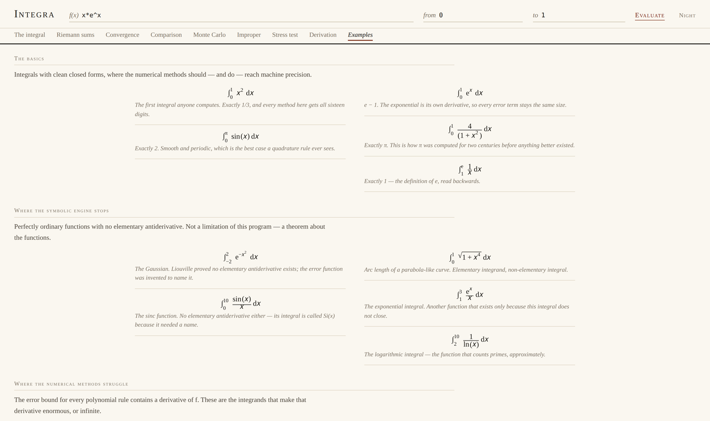

# Integra

*A working notebook for integral calculus.* Nine sections over one integral: draw it, approximate it, measure how fast the approximation converges, and go looking for the function that breaks the method you chose.

**[Open it →](https://kunz5.github.io/integra/)**


```bash
git clone https://github.com/Kunz5/integra.git && cd integra
python3 -m http.server 8000
```

That is the whole install. No packages, no bundler, no build step; ES modules just need to be served over http rather than opened from disk.

---

## The question it was built around

Ask any calculator for `∫₀¹ x² dx` and it says 0.333. Correct, and useless, because the number is the end of a derivation and the derivation is the interesting part.

Ask a computer algebra system for `∫₀¹ x^(−0.99) dx` and it says 100. Also correct, and quietly misleading, because that answer is unreachable in double precision. Two thirds of the area sits below x = 10⁻¹⁷, closer to zero than a floating-point number can get. You would have to already know that to know you were being told something you could not verify.

The questions I actually had were somewhere between the two:

Why does Simpson's rule, which is fourth-order, collapse to order 1.5 on √x, a function with no discontinuity anywhere?

Why is Monte Carlo integration the worst possible choice on an interval and the only possible choice in fifty dimensions?

When a program says "no closed form", is that a fact about the function or an admission about the program?

And how do you *see* the difference between an integral that converges slowly and one that diverges slowly, given that over any finite range of cut-offs the two look identical?

Integra is built so those can be answered by experiment rather than by looking them up.

## Nine ways in

Type a function once and every section works from it.

**The integral** draws the curve, shades the signed area, and gives the exact value if a symbolic antiderivative exists and a numerical one regardless.

**Riemann sums** is the definition made visible. Six rules, a slider for the interval count, and the strips redrawn from the geometry that was actually summed rather than from a separate description of it.

**Convergence** plots error against N on logarithmic axes, where a power law is a straight line and its slope is the order of the method. The slope is measured by regression, not assumed from a textbook.

**Comparison** runs thirteen methods at an identical evaluation budget, which is the only comparison that means anything, and explains the ordering it produced.

**Monte Carlo** shows the samples landing, reports a real confidence interval from the sample variance, and demonstrates the 1/√N wall by running a hundred times as many samples for one extra digit.

**Improper** draws the limit that the definition is written in: the partial integrals approaching, or refusing to.

**Stress test** holds a method fixed, walks a parameter through a family of integrands, and searches for the one that defeats it.

**Derivation** shows the whole working, in real MathML: definition, antiderivative, the verification that it is correct, the theorem, and what the quadrature actually did.

**Examples** is twenty-six integrals chosen because each demonstrates something specific, set out like a table of integrals rather than a menu.

<table>
<tr>
<td width="50%"><br><em>Riemann sums</em></td>
<td width="50%"><br><em>Every rule collapses to order 1.5 on √x</em></td>
</tr>
<tr>
<td width="50%"><br><em>Examples, set as a table of integrals</em></td>
<td width="50%"><br><em>The derivation, in MathML</em></td>
</tr>
</table>

---

## The symbolic side

There is no computer algebra library here. A hand-written lexer and a Pratt parser turn text into a tree; a simplifier pushes that tree into canonical form; a differentiator applies the rules; an integrator searches. The user's string becomes data and never becomes code, so nothing goes anywhere near `eval`.

**Parsing what people actually write.** `2x`, `3x^2`, `sin 2x`, `sin^2(x)`, `e^-x^2`, `|x-1|`, `√(1-x²)`. Getting `sin 2x` to mean sin(2x) while `sin x + 1` means (sin x) + 1 is a binding-power problem, and I got it wrong twice before getting it right. The failing case is in the test suite.

**Finding an antiderivative.** The classical toolkit, applied in order: the table of standard forms, linearity, linear substitution, general substitution searched over subexpressions, integration by parts ranked by LIATE, the cyclic case for e^(ax)·sin(bx) where parts never terminates and you solve for the integral algebraically, trigonometric substitution, trigonometric power reduction, and partial fractions with rational-root factorisation and a linear solve for the coefficients.

It gets `∫x⁵eˣ`, `∫eˣsin x`, `∫√(x²+9)`, `∫dx/(x³−x)`, `∫x²ln x`. It does not get `∫e^(−x²)`, and says so carefully:

> No elementary antiderivative was found by the rules this engine knows. **That is not a proof that none exists.** For some functions, such as e^(−x²) and sin(x)/x, it is known that none does; for others this engine is simply not clever enough.

**Checking it.** A search can go anywhere and a rule can be wrong, so every candidate antiderivative is differentiated and compared against the integrand before it is displayed. One that fails is discarded and the honest "not found" is returned instead. Structural equality after simplification counts as proof; when that fails, and on a correct answer it often does because no simplifier is complete, the check falls back to sampling at thirteen scattered points and the result is *labelled* as evidence rather than as proof. Richardson's theorem says nobody can do better in general.

There is one more check, and it is the one I like best. Consider:

```
∫₋₁¹ dx/x²
```

An antiderivative exists. It is −1/x. Evaluating F(1) − F(−1) gives **−2**, a negative number for the integral of a strictly positive function. The fundamental theorem requires continuity across the interval and there is a pole at zero. Integra tests that hypothesis before applying the theorem and refuses to evaluate, naming the discontinuity.

## The numerical side

Thirteen methods, each written from its definition.

Six fixed rules: left, right and midpoint Riemann, trapezoidal, and Simpson's 1/3 and 3/8.

**Gauss-Legendre** with the nodes computed rather than tabulated. Newton iteration on the Legendre polynomials from Tricomi's asymptotic starting guess, using the three-term recurrences, with wᵢ = 2/((1 − xᵢ²)P′ₙ(xᵢ)²). The tests check them against the published five-point values to 10⁻¹⁴, and check the property those values exist for: n points integrate degree 2n − 1 exactly and degree 2n not at all.

**Adaptive Simpson** with Richardson error control. Comparing an interval's estimate against the sum of its two halves gives |S₂ − S₁|/15 as an error estimate that costs nothing beyond samples already taken, and adding that difference back upgrades a fourth-order result to sixth.

**Romberg**, which is Richardson extrapolation applied to the trapezoidal rule against its Euler-Maclaurin error expansion. Each column of the table gains two orders; each row reuses every earlier sample by halving.

**Tanh-sinh**, the double-exponential transform, which is the one worth understanding. Substituting x = tanh(½π sinh t) makes the Jacobian decay doubly exponentially at both ends, so the endpoints are never evaluated and a singularity sitting on one costs nothing at all. `∫₀¹ dx/√x` comes out exact in 97 evaluations.

**Monte Carlo**, uniform and stratified and antithetic, each reporting a confidence interval derived from the sample variance.

### The bug that decides whether tanh-sinh is worth having

Its node nearest an endpoint sits about 10⁻¹⁷ away. Computing that abscissa as `centre + halfwidth·x` rounds it *onto* the endpoint, straight into the singularity the whole transformation exists to avoid. The distance from the endpoint has to be carried directly, as 1 − tanh u = 2/(1 + e^{2u}), which stays exact all the way down to underflow.

Before: `∫₀¹ dx/√x` returned 1.9999999888 after 12,525 evaluations. After: exact, in 97.

## What it tells you that a calculator will not

These are outputs. Run them.

**Order collapses at a singularity, and it collapses for every rule equally.** On √x over [0,1] the measured orders come out trapezoidal 1.48, midpoint 1.46, Simpson 1.50. Simpson's nominal fourth order buys nothing, because its error bound involves a fourth derivative and √x has an unbounded first one. The rule has not failed. Its hypothesis has.

**The trapezoidal rule is exact for |x|.** Over [−1, 1] with any even N the kink lands on a node, the interpolant reproduces the corner exactly, and the error sits at the round-off floor for every N. There is no rate to measure, and Integra says "no rate" rather than "order zero".

**No method wins.** At a fixed budget of 200 evaluations:

| Family of integrands | Best | Worst |
|---|---|---|
| sin(kx), k up to 400 | Gauss-Legendre, 1.5 × 10⁻¹³ | adaptive Simpson, 1.9 × 10² |
| a peak of width 1/3000 | adaptive Simpson, 7.5 × 10⁻⁶ | Simpson's 1/3, 2.3 |
| x^(−p), p up to 0.95 | tanh-sinh, 1.2 × 10⁻¹⁵ | *adaptive Simpson declines to answer* |

The rule that is untouchable in one row is last in the next. "Which method is best" is not a question with an answer until an integrand is attached to it.

**Slow convergence and slow divergence really are indistinguishable.** `∫₁^∞ x^(−1.01) dx` converges to 100 and needs a cut-off near 10³⁰ to reach even half of it. Integra returns "too slow to tell", with the reasoning, rather than guessing in either direction.

## Five rules about not lying

The worst thing a numerical tool can do is return a precise, confident, wrong number. Each of these is enforced somewhere specific in the code.

1. **A hole in the domain stays a hole.** `ln(−1)`, `1/0` and an overflow all evaluate to NaN, never to zero. A NaN silently read as zero would let `∫₀¹ dx/√x` return a beautiful wrong answer instead of triggering the improper path.
2. **A closed rule that cannot sample its endpoint refuses.** The alternatives are nudging the endpoint, which integrates a different function, or treating the singular sample as zero, which invents a value. Adaptive Simpson returns NaN with a written reason and a pointer to the method that can handle it.
3. **A convergence verdict is a diagnosis, never a proof.** Every one reads "appears convergent", "appears divergent", "oscillating" or "too slow to tell", and carries its reasoning and its limits.
4. **"Not found" is never dressed up as "does not exist."** Those are different statements and the interface keeps them apart.
5. **An adaptive method has a budget.** Without one, adaptive Simpson handed sin(x)/x over [10⁷, 10⁸] will try to resolve sixteen million oscillations and take the machine down with it. It now stops at a stated evaluation count and reports that the accuracy is unknown.

## Tests

280 assertions, no framework, plain `node`.

```bash
node test/math.test.mjs      # 104  parser, simplifier, differentiation, integration
node test/numeric.test.mjs   # 176  quadrature, convergence, Monte Carlo, improper
```

Everything is checked against something known before this program existed. The ones I would point at:

* Every antiderivative it finds is re-verified independently: 47 integrands, each differentiated back.
* Gauss-Legendre nodes against the published table to 10⁻¹⁴, plus the 2n − 1 exactness property.
* Measured convergence order against theory on smooth integrands, *and* the degradation on √x, *and* the halving on a kink.
* The 95% Monte Carlo interval covers the truth in 96.0% of 400 trials. Covering too often would be as wrong as too rarely.
* Every numeric claim made in the interface's own example blurbs, checked against quadrature.
* The drawn strips sum to the number the rule reports, so a picture can never disagree with its arithmetic.

Some tests assert that a method *fails*: that one tanh-sinh call over [−10⁶, 10⁶] misses a peak at the origin, that Gauss-Legendre manages only a few digits on a vertical tangent. If those ever start passing, an assumption underneath has changed and the code resting on it needs re-reading.

CI runs both suites on Node 20 and 22.

## What it can't do

One variable only: no double integrals, no polar or parametric regions. Real analysis only, no contour integration. The simplifier is incomplete, as every simplifier is, which is why verification has a numerical fallback. The integrator is a heuristic search rather than the Risch algorithm, so it will miss integrals that do have closed forms; it will not report a wrong one. Double precision is the floor, and `∫₀¹ x^(−0.99)` lives below it. `erf` is a 1.5 × 10⁻⁷ approximation, good enough to draw and not good enough to be a reference, so the Gaussian examples are checked against quadrature instead. Oscillatory integrals over an infinite range are unreliable and flagged as such.

Next, roughly in order: double integrals over a rectangle and then over a general region with a surface view, polar and parametric area, Clenshaw-Curtis and a Levin rule for oscillatory integrands, and an experiment builder that runs a method across a family and exports the table.

## Colophon

```
src/math/      parser, simplify, evaluate, derivative, integrate    2,472 lines
src/numeric/   quadrature, advanced, montecarlo, improper           1,230
src/lab/       convergence, breaker, examples                         557
src/ui/        plot, notation, app                                  2,092
test/          280 assertions                                         880
```

Layers depend downward only. `src/math` and `src/numeric` have no idea a screen exists, which is why the whole engine is testable in Node with no DOM.

Notation is real MathML generated from the same tree the engine computes with. No typesetting library, and no second prettier description of the expression that could drift away from the one being solved.

Set in Iowan Old Style, on cream.

*Kunaal Nirmal Khanwani, August 2026. MIT licensed.*
