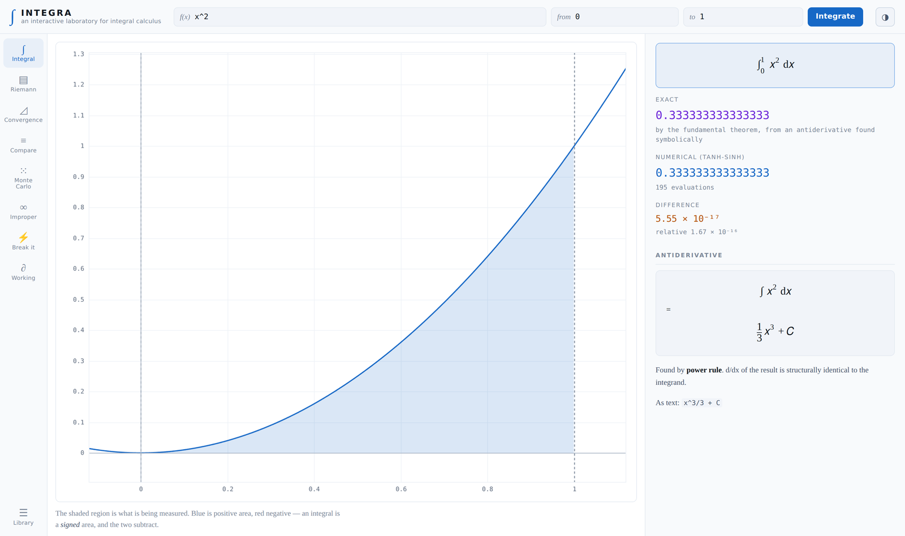
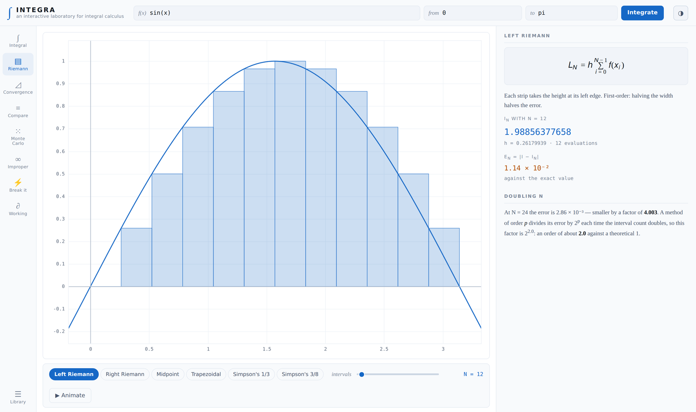
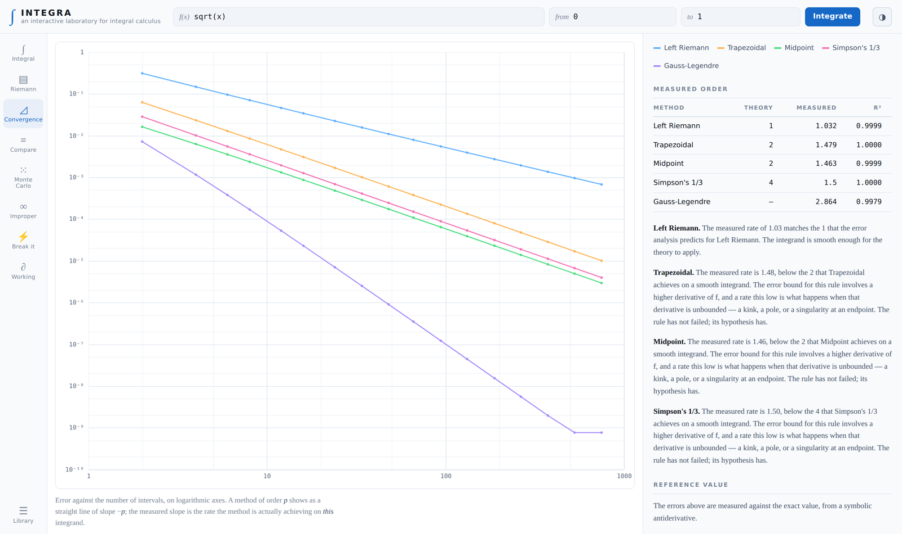
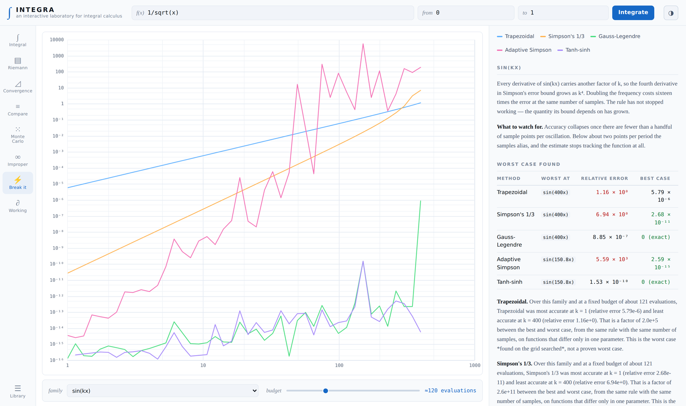
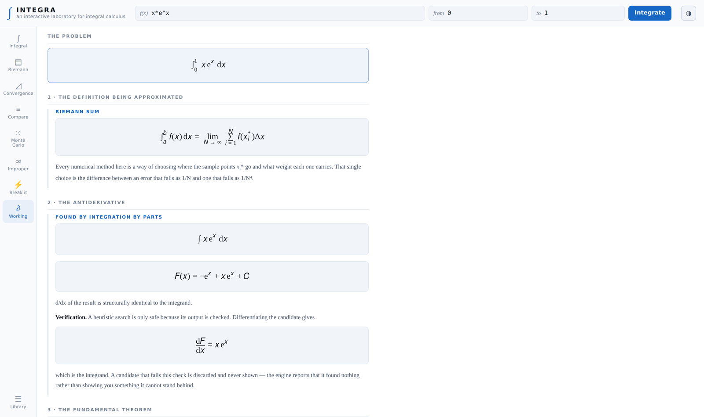

# INTEGRA

**An interactive laboratory for integral calculus.** Not a calculator — an instrument for finding out *how accurately the infinite can be measured by finite computation*, and where that measurement breaks.

Type a function. INTEGRA finds an antiderivative if one exists, computes the integral thirteen different ways, measures how fast each method converges on *your* integrand, and then goes looking for the function that defeats the one you picked.

**[▶ Open the laboratory](https://kunz5.github.io/integra/)**



*Author: Kunaal Khanwani · Built August 2026 · MIT licensed · no dependencies, no build step*

---

## The problem

Every integration tool I could find sits at one of two extremes.

A calculator takes `∫₀¹ x² dx` and returns `0.333…`. It is correct and it teaches nothing, because the number is the *end* of a derivation and the derivation is the part worth seeing.

A computer algebra system does far more, and is a closed box about all of it. Ask Mathematica for `∫₀¹ x^(−0.99) dx` and it says 100. That is the right answer and it is also unreachable in double precision — two thirds of that area lies below x = 10⁻¹⁷, closer to the origin than a floating-point number can resolve. Nothing tells you that. You would have to already know.

The questions I actually had were the ones neither answers:

- Why does Simpson's rule, which is fourth-order, drop to order 1.5 on √x — a function that is perfectly continuous?
- Why is Monte Carlo the worst possible method here and the only possible method in fifty dimensions?
- When a tool says "no closed form", is that a fact about the function or a limitation of the tool?
- How do I *see* the difference between an integral that converges slowly and one that diverges slowly, when over any finite range of cut-offs they look identical?

INTEGRA is built to answer those, by letting you run the experiment.

## What it is

Eight laboratories over one integral. Change the function at the top and every one of them updates.

| | |
|---|---|
| **Integral** | the graph, the shaded signed area, exact value where one exists, numerical value always |
| **Riemann** | the definition made visible — six rules, an interval slider, the sum animating as N climbs |
| **Convergence** | error against N on log-log axes; the slope *is* the order, and it is measured, not assumed |
| **Compare** | thirteen methods at an identical evaluation budget, with an explanation of who won and why |
| **Monte Carlo** | random sampling, a real confidence interval, and a demonstration of the 1/√N wall |
| **Improper** | the limit in the definition, drawn — partial integrals approaching, or failing to |
| **Break it** | hold the method fixed, walk a parameter, and search for the integrand that defeats it |
| **Working** | the whole derivation: definition → antiderivative → verification → theorem → quadrature |

<table>
<tr>
<td width="50%"><br><em>Riemann — the rule's own strips, drawn from the geometry that was summed</em></td>
<td width="50%"><br><em>Convergence — every rule collapses to order 1.5 on √x</em></td>
</tr>
<tr>
<td width="50%"><br><em>Break it — the same rule, the same budget, eight orders of magnitude apart</em></td>
<td width="50%"><br><em>Working — the derivation, in real MathML</em></td>
</tr>
</table>

---

## The mathematics

### A symbolic engine, written from scratch

There is no computer algebra library here. A hand-written lexer and Pratt parser turn text into an expression tree; a simplifier pushes that tree into canonical form; a differentiator applies the rules; an integrator searches for an antiderivative. Nothing goes near `eval` — the user's string becomes data, never code.

The parser accepts the notation people actually write: `2x`, `3x^2`, `sin 2x`, `sin^2(x)`, `e^-x^2`, `|x-1|`, `√(1-x²)`. Getting `sin 2x` to mean sin(2x) and `sin x + 1` to mean (sin x) + 1 is a binding-power problem that took three attempts.

**The integrator** applies the classical toolkit in order: the table of standard forms, linearity, linear substitution, general u-substitution searched over subexpressions, integration by parts ranked by LIATE, the cyclic case for e^(ax)·sin(bx), trigonometric substitution, trigonometric power reduction, and partial fractions with rational-root factorisation and a linear solve for the coefficients.

It handles `∫x⁵eˣ`, `∫eˣsin x`, `∫√(x²+9)`, `∫dx/(x³−x)`, `∫x²ln x`. It fails on `∫e^(−x²)` — and says so, in the words that matter:

> No elementary antiderivative was found by the rules this engine knows. **That is not a proof that none exists** — for some functions, such as e^(−x²) and sin(x)/x, it is known that none does; for others this engine is simply not clever enough.

### What makes a heuristic search safe

Search can go anywhere. A rule can be wrong. So **every candidate antiderivative is differentiated and checked against the integrand before it is shown**, and one that fails is discarded in favour of an honest "not found".

Structural equality after simplification counts as proof. When that fails — and it often does on a correct answer, because no simplifier is complete — the check falls back to sampling at thirteen scattered points, and the result is *labelled* as evidence rather than as proof. Richardson's theorem says no implementation can do better in general, and pretending otherwise would be the lie.

### And a hypothesis the fundamental theorem actually has

```
∫₋₁¹ dx/x²
```

An antiderivative exists: −1/x. Evaluating F(1) − F(−1) gives **−2** — a negative number for the integral of a strictly positive function. The theorem requires continuity across [a, b], and there is a pole at zero.

INTEGRA checks that hypothesis before applying the theorem, and refuses:

> The integrand is not continuous at x ≈ 0, which is inside [−1, 1]. The fundamental theorem of calculus does not apply across a discontinuity, so evaluating F(b) − F(a) here would produce a confident wrong number.

### Thirteen numerical methods, each from its definition

**Fixed rules** — left, right and midpoint Riemann; trapezoidal; Simpson's 1/3 and 3/8.

**Gauss-Legendre**, with the nodes *computed* rather than tabulated: Newton iteration on the Legendre polynomials from Tricomi's asymptotic start, using the three-term recurrences, with wᵢ = 2/((1−xᵢ²)P′ₙ(xᵢ)²). The tests check them against the published five-point values to 10⁻¹⁴ and verify the defining property — n points integrate degree 2n−1 exactly, and degree 2n not at all.

**Adaptive Simpson** with Richardson error control. |S₂ − S₁|/15 is an error estimate that costs nothing beyond samples already taken, and adding it back upgrades a fourth-order estimate to sixth.

**Romberg** — Richardson extrapolation against the trapezoidal rule's Euler-Maclaurin expansion, each column gaining two orders, and each row reusing every sample by halving.

**Tanh-sinh**, the double-exponential transform. Substitute x = tanh(½π sinh t) and the endpoints are never evaluated, so a singularity there costs nothing: `∫₀¹ dx/√x` comes out exact in 97 evaluations.

**Monte Carlo** — uniform, stratified, and antithetic, each with a real confidence interval from the sample variance.

### The bug that decides whether tanh-sinh works at all

The node nearest an endpoint sits at a distance of about 10⁻¹⁷. Computing its abscissa as `c + half·x` rounds it *onto* the endpoint — straight into the singularity the entire transformation exists to avoid. The distance from the endpoint has to be carried directly, as 1 − tanh u = 2/(1 + e^{2u}), which stays exact down to underflow.

Before that fix: `∫₀¹ dx/√x` = 1.9999999888, in 12,525 evaluations. After: exact, in 97.

---

## Findings the laboratory produces

These are outputs, not claims in the README. Run them yourself.

**Order collapses at a singularity, for every rule equally.** On `√x` over [0,1] the measured orders are trapezoidal 1.48, midpoint 1.46, Simpson 1.50. Simpson's nominal fourth order buys nothing, because its error bound involves a fourth derivative and √x has an unbounded first one. *The rule has not failed; its hypothesis has.*

**The trapezoidal rule is exact for |x|.** On [−1, 1] with any even N the kink lands on a node, the interpolant reproduces the corner, and the error is at the round-off floor at every N. There is no rate to measure, and INTEGRA reports "no rate" rather than "order zero".

**No method wins.** At a fixed budget of 200 evaluations:

| Family | Best | Worst |
|---|---|---|
| sin(kx), k up to 400 | Gauss-Legendre, 1.5×10⁻¹³ | adaptive Simpson, 1.9×10² |
| a peak of width 1/3000 | adaptive Simpson, 7.5×10⁻⁶ | Simpson's 1/3, 2.3 |
| x^(−p), p up to 0.95 | tanh-sinh, 1.2×10⁻¹⁵ | *adaptive Simpson refuses entirely* |

The same rule that is untouchable in one row is last in another. "Which method is best" has no answer until an integrand is attached to it.

**Slow convergence and slow divergence are genuinely indistinguishable.** `∫₁^∞ x^(−1.01) dx` converges to 100 and needs a cut-off around 10³⁰ to reach half of it. INTEGRA's verdict is *"too slow to tell"* — with the reasoning shown — rather than a guess in either direction.

---

## Honesty rules the code enforces

The single most dangerous thing a numerical tool can do is return a precise, confident, wrong number. Five rules, each enforced somewhere specific:

1. **A hole in the domain stays a hole.** `ln(−1)`, `1/0` and an overflow all evaluate to NaN, never to zero. A NaN read as zero would let `∫₀¹ dx/√x` return a beautiful wrong answer instead of triggering the improper-integral path.
2. **A closed rule that cannot sample its endpoint refuses.** The alternatives are nudging the endpoint — which integrates a *different function* — or reading the singular sample as zero. Both are fabrication. Adaptive Simpson returns NaN with a written reason and a pointer to the method that can do it.
3. **A convergence verdict is a diagnosis, never a proof.** Every one is phrased "appears convergent", "appears divergent", "oscillating", "too slow to tell", and every one carries its reasoning and its limits.
4. **"Not found" is never dressed up as "does not exist".** The two are different statements and the interface keeps them apart.
5. **An adaptive method has a budget.** Without one, adaptive Simpson handed sin(x)/x over [10⁷, 10⁸] will try to resolve sixteen million oscillations and consume the machine. It now stops at a stated evaluation count and says the accuracy is unknown.

## Correctness

**280 assertions**, no framework, run with plain `node`.

```bash
node test/math.test.mjs      # 104 — parser, simplifier, differentiation, integration
node test/numeric.test.mjs   # 176 — quadrature, convergence, Monte Carlo, improper
```

Everything is checked against a value known before this program existed. Notable ones:

- **Every antiderivative it finds is re-verified independently** — 47 integrands, each differentiated back to its integrand.
- **Gauss-Legendre nodes against the published table** to 10⁻¹⁴, plus the 2n−1 exactness property.
- **Measured convergence order against theory** on smooth integrands, *and* the degradation on √x, *and* the halving on a kink.
- **The 95% Monte Carlo interval covers the truth 96.0% of 400 trials.** Too often would be as wrong as too rarely.
- **The library's own claims** — every value asserted in the interface's example blurbs is checked against quadrature.
- **The drawn strips sum to the reported number**, so a picture can never disagree with its arithmetic.

Some tests assert that a method *fails*: that a single tanh-sinh call over [−10⁶, 10⁶] misses a peak at the origin, that Gauss-Legendre manages only a few digits on a vertical tangent. If those start passing, an assumption has changed and the code that depends on it needs re-reading.

CI runs both suites on Node 20 and 22.

---

## Running it

No build step, no dependencies, no install.

```bash
git clone https://github.com/Kunz5/integra.git
cd integra
python3 -m http.server 8000     # any static server; ES modules need http://
```

Then open `http://localhost:8000`. Keys `1`–`9` switch laboratories.

```
integra/
├── src/math/      parser · simplify · evaluate · derivative · integrate   (2,472 lines)
├── src/numeric/   quadrature · advanced · montecarlo · improper           (1,230)
├── src/lab/       convergence · breaker · examples                          (557)
├── src/ui/        plot · notation · app                                   (2,092)
└── test/          280 assertions                                            (880)
```

The layers depend only downward. `src/math` and `src/numeric` have no idea a screen exists, which is why the whole engine is testable in Node with no DOM.

**Notation** is real MathML generated from the same tree the engine computes with — no typesetting library, and no second prettier description of the expression that could drift from the one being solved.

---

## Limitations

- **One variable.** No double integrals, no polar or parametric regions. The architecture would take them; they are not written.
- **Real analysis only.** No complex contour integration.
- **The simplifier is incomplete**, as every simplifier is. It sometimes cannot prove two equal expressions equal, which is why verification falls back to sampling.
- **The integrator is a heuristic search, not the Risch algorithm.** It will miss integrals that have closed forms. It will not report a wrong one.
- **Double precision is the floor.** `∫₀¹ x^(−0.99)` is unreachable in this arithmetic; INTEGRA reports non-convergence rather than the 29.9 it could resolve.
- **`erf` is a 1.5×10⁻⁷ approximation** — good enough to draw, not good enough to be a reference. The Gaussian examples are checked against quadrature instead.
- **Oscillatory infinite integrals are unreliable**, and flagged as such. `∫₀^∞ sin(x)/x` lands within 0.5% of π/2 and is labelled "oscillating — do not trust beyond a digit or two".

## Where it goes next

Double integrals over a rectangle and over a general region, with a 3-D surface view; polar and parametric area; Clenshaw-Curtis and a Levin-type rule for oscillatory integrands; an experiment builder that runs a method across a family of functions and exports the table; arbitrary precision behind the double-precision floor.

---

*Built by Kunaal Khanwani, August 2026. Vanilla JavaScript, no framework, no dependencies, no build tooling. MIT licensed — use it, fork it, teach with it.*
